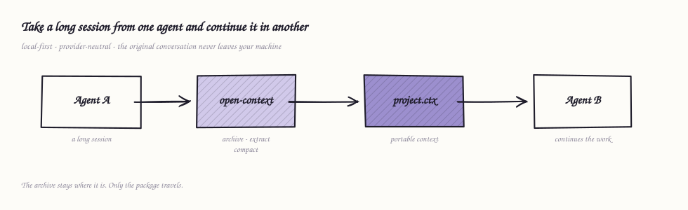
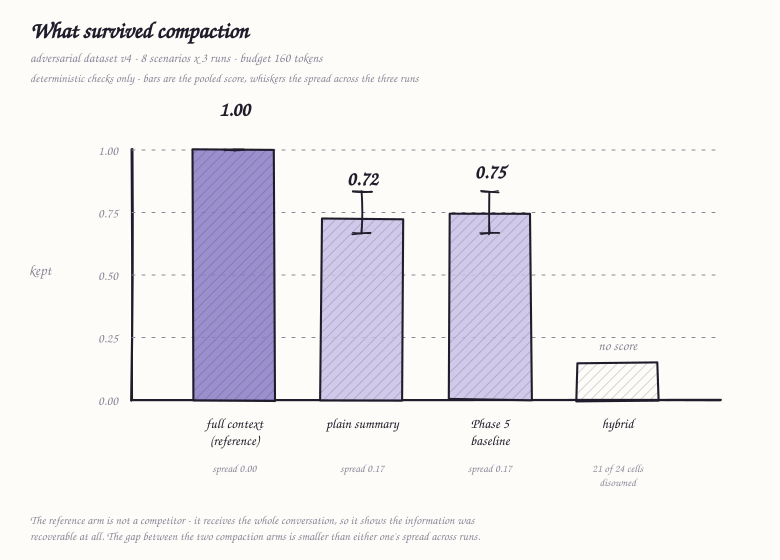
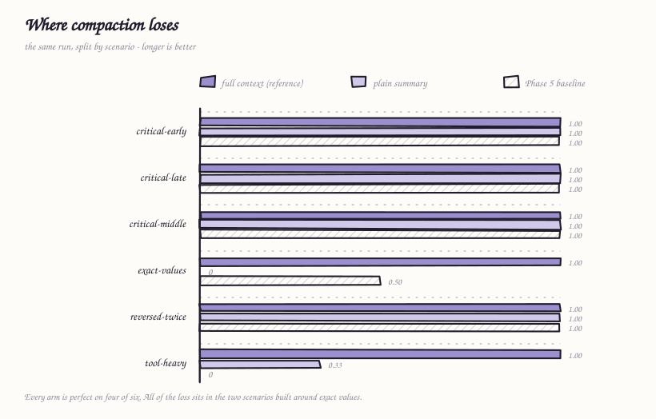
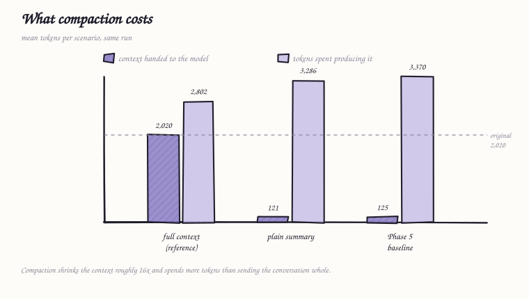
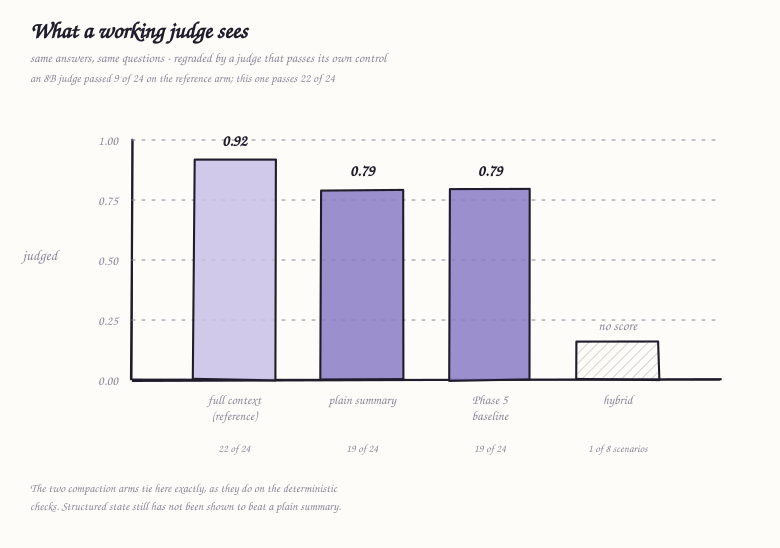
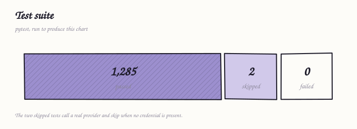

# MemHandoff

**Move useful working context from Agent A to Agent B.**

MemHandoff is a local-first command-line tool that turns an agent conversation
into a portable, inspectable `.ctx` file, then compiles it into context another
agent can use. The original conversation stays on your machine unless you
explicitly opt into model-based extraction.


This is an experimental open-source side project. The useful question is not
whether it sounds like “AI memory”; it is whether a different agent can actually
continue your work. Try it, break it, and tell us what disappeared.

*Python package: `open-context-runtime` · CLI: `open-context` · License: Apache-2.0*

## Try a real handoff in under five minutes

The example is offline, uses no API key, and hands a small Agent A coding session
to generic Agent B context. These commands install the current source on macOS
or Linux and run the complete workflow:

```bash
git clone https://github.com/0sha-dow0/memhandoff.git
cd memhandoff
python3 -m venv .venv
source .venv/bin/activate
python -m pip install .
./examples/cross-agent-handoff/run.sh
```

The last line writes `memhandoff-demo/agent-b-context.json`. Paste its `text`
value into ChatGPT, Claude, Codex, Gemini, a local model, or another compatible
agent and ask:

> What should you do next, and what must you not change?

Agent B should recover the encoding and byte-order mark, two exact row counts,
the forbidden storage location, the deployment constraint, the rejected Kafka
approach, and who owns port 9443. The full expected result is in the
[cross-agent example](examples/cross-agent-handoff/README.md).

The script runs the same three commands you use on your own data:

```bash
open-context handoff agent-a.jsonl --store demo/archive --out demo/export.ctx
open-context validate demo/export.ctx --archive demo/archive
open-context compile demo/export.ctx \
  --target generic --budget 800 --task "Continue the export work."
```

[Replay the short terminal recording](docs/assets/cross-agent-handoff.cast) with
`asciinema play docs/assets/cross-agent-handoff.cast`.

The published package is also available with
`pip install open-context-runtime`. The current public release is `v0.1.0`;
changes on `main` may be unreleased.

## Use your own conversation

MemHandoff currently reads Claude Code transcripts and generic JSON Lines:

```bash
open-context sessions
open-context handoff <transcript>.jsonl \
  --store ./ctx --out project.ctx --title "My work"
open-context inspect project.ctx
open-context validate project.ctx --archive ./ctx
open-context compile project.ctx \
  --target anthropic --budget 4000 --task "Continue this work."
```

`compile` prints a request body shaped for `anthropic`, `openai`, `gemini`,
`local`, or `generic`. MemHandoff does not send that request; you choose where
the compiled context goes.

Without `--extract`, the package contains recent spoken turns and provenance,
not inferred goals, constraints, or decisions. The CLI warns about this every
time. Add `--extract` only when you deliberately want the configured model to
read the archived session:

```bash
export OPEN_CONTEXT_PROVIDER=groq       # or openrouter
export OPEN_CONTEXT_MODEL=<model>
export OPEN_CONTEXT_API_KEY=<key>

open-context handoff session.jsonl \
  --store ./ctx --out project.ctx --extract
```

The project itself uses free models only for tests and benchmarks and has no paid
fallback. That is a repository policy, not a restriction on users: you may use
any compatible provider or model. Never put a credential in a transcript,
package, issue, or commit.

See [Getting started](docs/getting-started.md) for formats, Windows setup, model
configuration, and the exact contents of a handoff.

## What travels

```text
Agent A conversation
        |
   import + archive       original records stay local and hashed
        |
   optional extraction    typed goals, constraints, decisions, evidence
        |
     project.ctx          portable, provider-neutral, inspectable
        |
   compile per target     budgeted context in the receiving agent's shape
        |
Agent B continues
```



Three layers stay separate:

| Layer | Purpose | Portable? |
| --- | --- | --- |
| Raw conversation | Lossless local source archive | No |
| `.ctx` package | State, recent turns, evidence, provenance | **Yes** |
| Compiled context | Budgeted input for one target family | Generated on demand |

A `.ctx` is JSON, versioned and content-hashed. It references the local archive
instead of copying the whole conversation. A receiver without that archive can
check the package's internal integrity; a receiver with it can also check
record-level provenance. See the [format](docs/ctx-format.md),
[handoff](docs/handoff.md), and [compiler](docs/compiler.md) docs.

## Honest limitations

- **Continuation quality does not match full context in the published
  benchmark.** Full context retains 1.00; the measured compaction arms retain
  0.72 and 0.75.
- **Structured compaction has not been shown to beat a plain summary.** The
  0.03 difference is smaller than run-to-run variation.
- **Hybrid compaction is inconclusive.** Extraction failed on 21 of 24 cells,
  so the Phase 8 measurement exit criterion remains unmet and the arm has no
  score.
- **Long sessions can lose important facts.** Recent-only handoff carries at
  most 12 spoken turns. Model extraction varies by model, and lexical retrieval
  misses facts when the task and evidence use different words.
- **Import coverage is early.** Claude Code and generic JSON Lines are supported;
  most agent-specific export formats still need adapters.
- **Automatic capture is minimal.** Only Claude Code's `PreCompact` hook is
  implemented.
- **A valid package is not a safe package.** Validation checks structure,
  hashes, and optional provenance. It does not reliably detect prompt injection
  or make imported text trustworthy.
- **This is pre-1.0 spare-time software.** There is no production-readiness
  claim, support commitment, or patch SLA.

## What the measurements say

The current published adversarial benchmark is deliberately visible even though
it does not establish superiority:

| Arm | Deterministic retention | Judged | Reading |
| --- | ---: | ---: | --- |
| Full context | 1.00 | 0.92 | Reference, not a competitor |
| Simple summary | 0.72 | 0.79 | One-call baseline |
| Phase 5 baseline | 0.75 | 0.79 | Does not clearly beat summary |
| Hybrid | — | — | Inconclusive; exit criterion unmet |



At 9–14× compression, all observed losses cluster in scenarios involving exact
values.



Compaction also spends more total tokens than sending these relatively short
conversations whole. The project has not established where that tradeoff becomes
worthwhile.



The judged column was blank until recently, and the reason is worth stating.
Judged questions ask whether something was *avoided*, which no substring check
can decide: the same term appears in an endorsement and in a rejection. The 8B
model grading them could not make that distinction — it failed answers for
naming UTF-8 only to rule it out — and it passed just 9 of 24 questions on the
arm holding the entire conversation. A grader that cannot pass the control
cannot grade anything below it, so every judged number was withheld.

Regraded by a model large enough to read a rejection, the reference arm passes
22 of 24 and the column becomes legible. It says the same thing the
deterministic checks say: the two compaction arms tie, at 0.79 each. Structured
state still has not been shown to beat a plain one-call summary, and now it has
not been shown on two independent measures rather than one.



Negative and inconclusive runs are not hidden or retuned. Read the full
[benchmark methodology](docs/benchmark.md), [adversarial results](docs/adversarial.md),
and [retrieval limitations](docs/retrieval.md).

## Break it for us

The most valuable contribution is a case where Agent B cannot continue because
MemHandoff dropped, changed, or misrepresented something. Exact values, negative
constraints, reversed decisions, failed approaches, and old facts crowded out
by tool output are especially useful.

1. Run a handoff.
2. Compare Agent B's context with what actually mattered.
3. Reduce private data to a small synthetic conversation if possible.
4. Open a **[Context Loss Report](https://github.com/0sha-dow0/memhandoff/issues/new?template=context-loss.yml)**.

Remove credentials, private conversations, proprietary code, customer data, and
personal information before attaching anything. A `.ctx` contains real
conversation text; read it first.

Other paths:

- [Report a software bug](https://github.com/0sha-dow0/memhandoff/issues/new?template=bug-report.yml)
- [Challenge the benchmark](https://github.com/0sha-dow0/memhandoff/issues/new?template=benchmark-challenge.yml)
- [Propose an architecture change](https://github.com/0sha-dow0/memhandoff/issues/new?template=architecture-proposal.yml)
- [Start an open-ended issue](https://github.com/0sha-dow0/memhandoff/issues/new)

An issue that becomes a discussion is welcome. A failing synthetic transcript is
more useful than a vague success story.

## Develop and contribute

```bash
python3 -m venv .venv
source .venv/bin/activate
python -m pip install -e ".[dev]"

pytest -q
ruff check .
ruff format --check
mypy .
python -m build
```



Tests run offline by default. Do not add paid calls, paid fallbacks, secrets, or
real private transcripts. Do not change benchmark scenarios to improve a score.

[CONTRIBUTING.md](CONTRIBUTING.md) covers setup and review expectations.
[CODE_OF_CONDUCT.md](CODE_OF_CONDUCT.md), [SECURITY.md](SECURITY.md), and the
[documentation index](docs/README.md) cover participation, disclosure, and the
deeper implementation.

## License

Apache-2.0. See [LICENSE](LICENSE) and [THIRD_PARTY_NOTICES.md](THIRD_PARTY_NOTICES.md).
